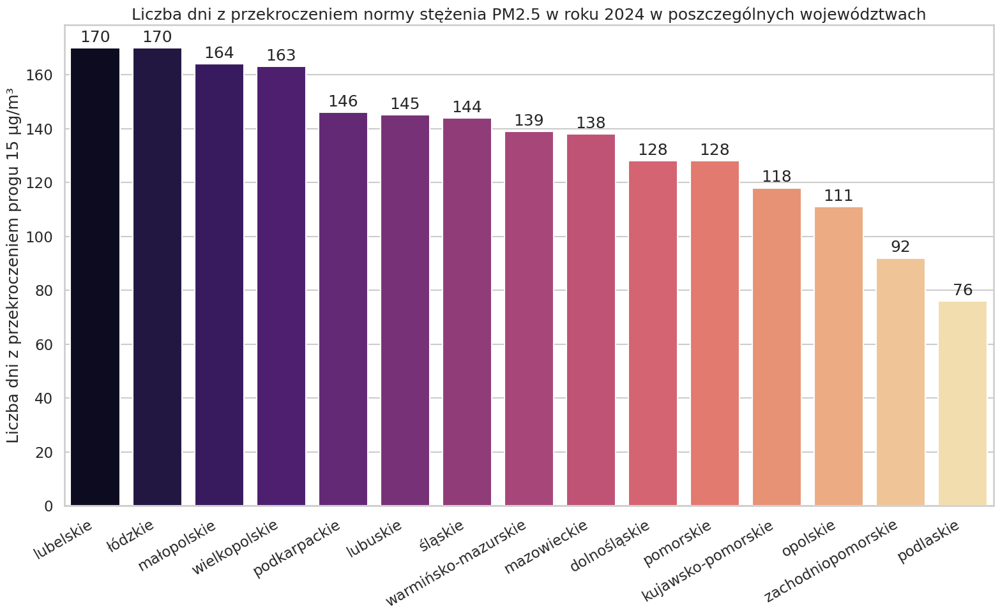

## Udało się przemycić niespodziankę!
Funkcja `wojew_over_treshold()` oblicza średnią pomiarów PM2.5 w danym roku w danym województwie. Nie powiedziałem jednak (i nie zostało to podniesione w procesie rewizji kodu) w jaki sposób średnia ta jest liczona...

Napisana przeze mnie funkcja w module `stats.py` uśrednia pomiary najpierw wewnątrz stacji, a dopiero potem w obrębie województwa. Jest to niepoprawne podejście - niektórym stacjom brakuje pomiarów co oznacza, że poszczególne pomiary nie są ważnone równomiernie w ostatecznej średniej.

Fragment niepoprawnej wersji `wojew_over_treshold()`:

```python
    daily  = (
        long
        .groupby(["Województwo", "Kod stacji", "date"], as_index=False)
        .agg(PM25=("PM25", "mean"))
    )
    wojew_means = (
        daily
        .groupby(['date', "Województwo"], as_index=False)
        .agg(PM25=("PM25", "mean"))
    )

    wojew_means['exceeds_treshold'] = wojew_means['PM25'] > treshold
    counts = wojew_means.groupby('Województwo')['exceeds_treshold'].sum()
```

Poprawna funkcja `wojew_over_treshold()` (znajdująca się w module `poprawne.py`) po prostu grupuje dane z jednego dnia po województwach, bez rozróżnienia na stacje:


```python
    daily  = (
        long
        .groupby(["Województwo", "date"], as_index=False) # to jest dobre grupowanie
        .agg(PM25=("PM25", "mean"))
    )

    daily['exceeds_treshold'] = daily['PM25'] > treshold
    counts = daily.groupby('Województwo')['exceeds_treshold'].sum()
```

Koncepcyjnie, różnica działania tych dwóch funkcji jest bardzo duża, jednak brakujących pomiarów nie jest aż tak wiele. Pomimo to, końcowy wykres jest odrobinę inny w zależności od tego, którą funkcję się wybierze - województwa **dolnośląskie** i **kujawsko-pomorskie** mają różną liczbę dni przekraczających normę w zależności od metody uśredniania.


Wykres 1: Poprawny


Wykres 2: Niepoprawny


---
*Aleksander Janowiak 19.01.2026*

*Opublikowano: 20.01.2026*